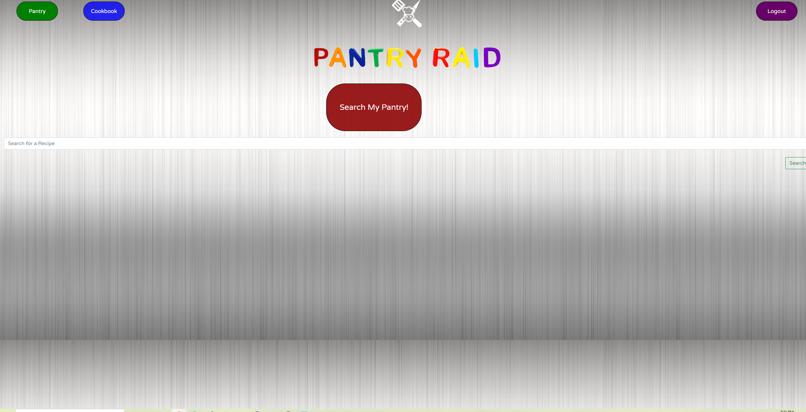
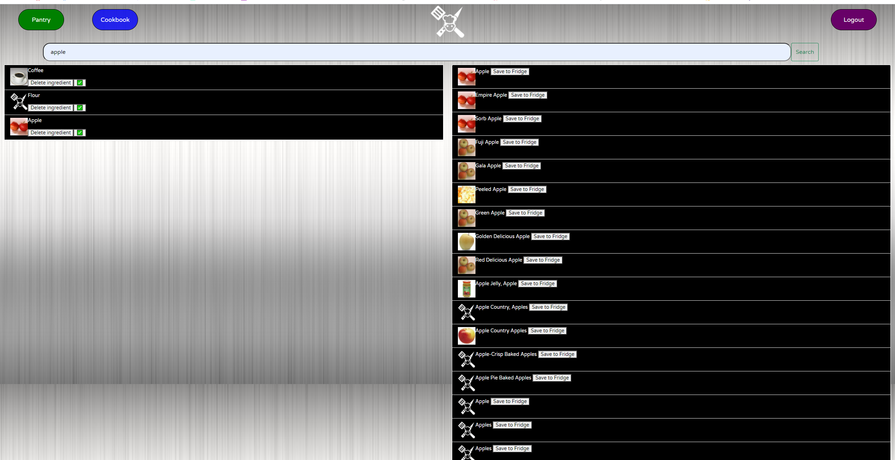
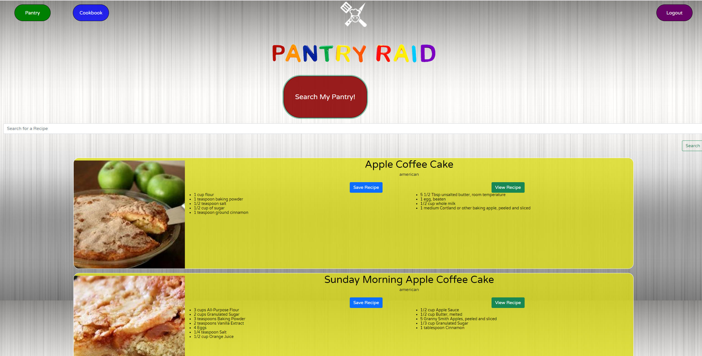
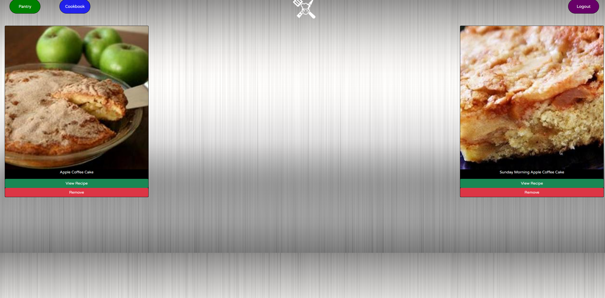

# PantryRair: Recipe Finder

## Summary 
Pantry Raid is an application designed to help you find recipes that you can make with ingredients you currently own. Based on the ingredients in your pantry, the program will present you with different recipies!

## Built With
-React

-React Bootstrap

## Visual Walkthrough 

The homepage of pantryRaid



The pantry, with your current ingredients on the left, and the searched for ingredients on the right



Back on the Homepage, you can hit the big red Search My Pantry button, and recipes that include your current pantry ingredients that you gave a green checkmark will be used in the search!



By clicking the save recipe button, you are able to save current recipes to your cookbook for easy future access, shown below




## Code Snippets


The API call to the edamam recipe database, which uses template literales to insert the ingredients from your pantry into the query 
```
 getRecipesTest: function (search) {
      return axios.get(
        `https://api.edamam.com/search?q=${search}&app_id=7cf0a1d3&app_key=536d6fab537d44cae44549e0fe9cf794`
      );
    }
  },
  ```

  How we dynamically changed the icon on the pantry page to flag whether the ingredient would be used in the search
```
const PantryMyFridge = (props) => {
  const { label, image, deleteIngredient, looking, setLookie } = props;

  if(looking === true){
  return (
    <li className="list-group-item list-group-item-dark">
      

      <p className="label"> {label}</p>
      <button onClick={deleteIngredient}>Delete ingredient </button>
      <button onClick={setLookie}>✅</button>
      

    </li>
  );
} else {
  return (
    <li className="list-group-item list-group-item-dark">
      

      <p className="label"> {label}</p>
      <button onClick={deleteIngredient}>Delete ingredient </button>
      <button onClick={setLookie}>❌</button>
      

    </li>
  );
}
};
```

Many other funtions were used to save ingredients and recipies to a SQL database, as well as pull from the database and update it
```
  saveRecipe: function (savedRecipe) {
    return axios.post("/api/Recipe", savedRecipe);
  },

  saveIngredient: function (savedIngredient) {
    return axios.post("/api/Ingredient", savedIngredient);
  },

  getSavedRecipes: function () {
    return axios.get("/api/Recipe");
  },

  getSavedIngredients: function () {
    console.log("pleeeeeease");
    return axios.get("/api/Ingredient");
  },

  saveUser: function (savedUser) {
    return axios.post("/api/User", savedUser);
  },

  checkUser: function (loginData) {
    return axios.post("api/User/login", loginData);
  },

  deleteRecipe: function (id) {
    console.log("coke coffee");
    return axios.delete("/api/Recipe/" + id);
  },

  deleteIngredient: function (id) {
    console.log("coke not coffee");
    return axios.delete("/api/Ingredient/" + id);
  },

  updateIng: function (id, looking) {
    console.log("updated!");
    return axios.put("/api/Ingredient/" + id, { looking });
  },
};
```

## My Links

[Serena's GitHub](https://github.com/SerenaChandler)


[Thomas' GitHub](https://github.com/TMPeeler)


[Marko's GitHub](https://github.com/markosanchez800)


[Patrick's GitHub](https://github.com/pattymcpat)

[repo](https://github.com/SerenaChandler/PantryRaid)

[deployed app](https://pantryraiders.herokuapp.com/)